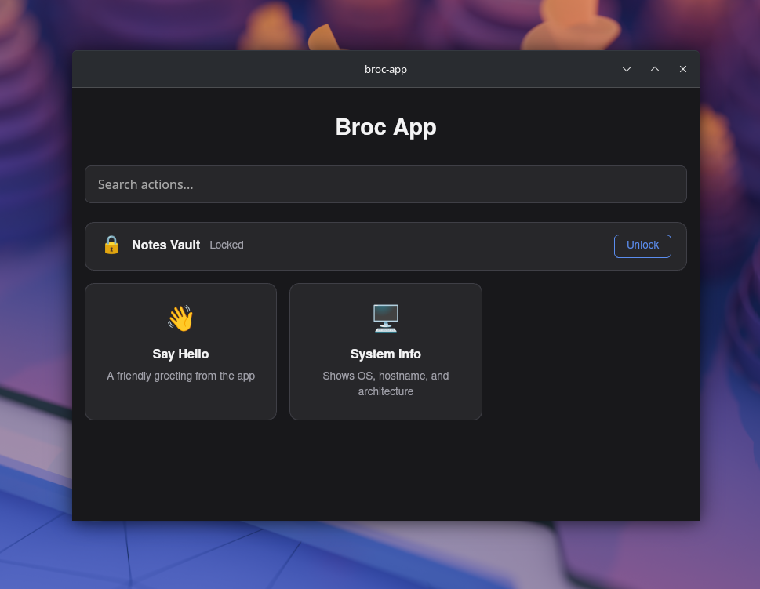

# broc-app

A personalized, cross-platform (Windows and Linux) desktop app.

## Compiling, Running

### Compiling
npm install, have webkit2gtk-4.1 installed.

### Running
- `npm run tauri dev` — run the full app (frontend + Rust backend) in development mode
- `npm run tauri build` — produce a distributable binary
- `npm run build` — build frontend only (Vite/SvelteKit static output to `build/`)
- `npm run check` — run svelte-check for type checking
- `cargo check` — check Rust compilation (run from `src-tauri/`)

## Adding new Actions

- Add .rs file in src-tauri/src/actions/, export in mod.rs, register in lib.rs generate_handler![]
- Add .ts file in src/lib/actions/ that calls registerAction(), import in index.ts
